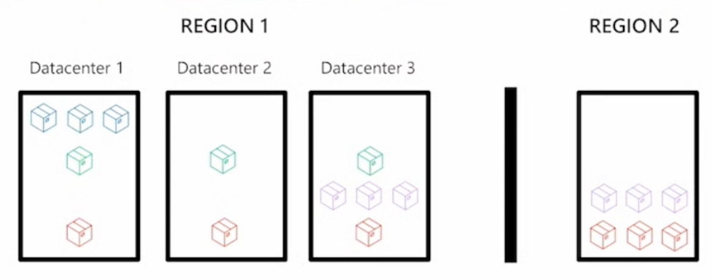

# AZ-900

[Back to README.md](README.md)

---

http://aka.ms/az-900

---

## 1. Cloud fundamentals

### 1.1. **Cloud Computing**

#### 1.1.1. What is cloud computing

- Is the delivering of computing services over the internet, enabling faster innovation, flexible resources, and economies of scale
- **Compute - Networking - Storage**

#### 1.1.2. Shared responsibility model

|                              | Responsibility                        | SaaS    | PaaS    | IaaS  | On-P. |
| ---------------------------- | ------------------------------------- | ------- | ------- | ----- | ----- |
| **Retained by the customer** | Information and data                  | **C**   | **C**   | **C** | **C** |
|                              | Devices (mobile and PCs)              | **C**   | **C**   | **C** | **C** |
|                              | Account and identities                | **C**   | **C**   | **C** | **C** |
| **Varies by type**           | Identity and directory infrastructure | **M/C** | **M/C** | **C** | **C** |
|                              | Applications                          | **M**   | **M/C** | **C** | **C** |
|                              | Network controls                      | **M**   | **M/C** | **C** | **C** |
|                              | Operating systems                     | **M**   | **M**   | **C** | **C** |
| **To cloud provider**        | Physical hosts                        | **M**   | **M**   | **M** | **C** |
|                              | Physical network                      | **M**   | **M**   | **M** | **C** |
|                              | Physical datacenter                   | **M**   | **M**   | **M** | **C** |
| M: Microsoft, C: Customer    |                                       |         |         |       |       |
|                              |                                       |         |         |       |       |

#### 1.1.3. Cloud models

| Cloud types       | Characteristics                                               |
| ----------------- | ------------------------------------------------------------- |
| **Private cloud** | Organizations create a cloud environment in their datacenter  |
|                   | Control all data and infrastructure                           |
|                   | Hardware must be purchased for start-up and maintenance       |
|                   | Countable to fix any issues                                   |
|                   | Responsible for operating services                            |
|                   | No access to users outside of the organization                |
| **Public cloud**  | Organizations create a cloud environment in their datacenter  |
|                   | Azure, GCP, AWS ...                                           |
|                   | Owned by cloud services or hosting provider                   |
|                   | Accessed via secure network connection                        |
|                   | Pay-as-you-go model                                           |
|                   | No capital expenditures to scale up                           |
|                   | Applications can be quickly provisioned and deprovisioned     |
| **Hybrid cloud**  | Combines public and private clouds                            |
|                   | to allow applications to run in the most appropriate location |
|                   | Provide most flexibility                                      |
|                   |                                                               |

#### 1.1.4. Capital vs Operational costing

- **CapEx**
  - The up-front spending of money on physical infrastructure
  - Cost have a value that reduces over time
- **OpEx**
  - Spend on products and services as needed
  - Get billed immediately

### 1.2 **Cloud Benefits**

#### 1.2.1. Benefits of the cloud

- **High availability**
- **Scalability** (ability to scale - vertically or horizontally)
  - **Vertically** (8GB of RAM to 16GB of RAM for instance)
  - **Horizontally** (Adding another VM or resource)
- **Elasticity** (scale automatically)
- **Reliability**
- **Predictability**
- **Security**
- **Governance**
- **Manageability**

### 1.3 **Cloud Service Types**

#### 1.3.1. IaaS, PaaS and SaaS

- **Infrastructure as a Service (IaaS)**

  - Most flexible and maximum cloud control
  - Configure and manage the hardware

- **Platform as a Service (PaaS)**

  - Focus on applications
  - No focus on managing underlying infrastructure
  - Platform management is handled by the cloud provider

- **Software as a Service (SaaS)**

  - Pay-as-you-go
  - Cloud-based apps over the internet (email, Office 365 ...)

## 2. Azure architecture and Azure compute services

### 2.1. **Azure architectural components**

#### 2.1.1. Regions and Availability Zones

- **Regions**

  - More then 60 regions over 140 countries
  - One or mode datacenters in close proximity
  - Provide flexibility and scale to **reduce** customer **latency**
  - Preserve data residency with a comprehensive compliance offering

- **Availability zones** (to improve redundancy)

  - Provide **protection against** downtime due to datacenter **(local) failure**
  - Physically **separate** datacenters within the **same region**
  - Each datacenter has independent resources
  - Connected through private fiber-optic networks
  - |                     | Azure Region |                     |
    | ------------------- | :----------: | ------------------- |
    | Availability Zone 1 |    <---->    | Availability Zone 2 |
    | Availability Zone 2 |    <---->    | Availability Zone 3 |
    | Availability Zone 1 |    <---->    | Availability Zone 3 |

- **Region Pairs** (to improve redundancy to other region)

  - Prevent natural disaster
  - At least 300 miles of separation between region pais
  - **Automatic replication** for some services
  - Updates are rollout sequentially to minimize downtime

- **Azure Sovereign Regions** (physically isolated instance of Azure)
  - **US Government services**
    - Separate instance of Azure
    - Accessible only to screened, authorized personal
    - Physically isolated
  - **China**
    - Public cloud service data
    - All data stays in China
    - Operated by 21Vianet

#### 2.1.2. Subscriptions and Resource Groups

- **Resources**

  - Are components like storage, VM and networks that are available to build cloud solutions
  - **Examples**: VMs, Storage Accounts, Virtual Networks, App Services, SQL Databases, Functions

- **Resource groups**

  - Is a container to manage and aggregate resources in a single unit
    - Resources can exist in only one resource group
    - Resource can exist in different regions
    - Resources can be moved to different resource groups
    - Applications can utilize multiple resource groups
    - Cannot be nested

- **Azure Subscription**

  - Provides you with authentication and authorized access to Azure accounts:

    - **Billing boundary**

      - Generate separate billing reports and invoices for each subscription

    - **Access control boundary**
      - Manage and control access to the resources that users can provision with specific subscriptions
      - ```mermaid
        flowchart TD
            AC[Azure Account] --> S1[Dev Subscription]
            AC[Azure Account] --> S2[Test Subscription]
            AC[Azure Account] --> S3[Production Subscription]
        ```

- **Management Groups**

  - Management groups can include multiple subscriptions
  - Subscriptions inherit conditions applied to the management group
  - Management groups tree can support up to six levels of depth
  - ```mermaid
    flowchart TD
        MG[Management Group] --> S1[Dev. Subscription]
        MG --> S2[Test. Subscription]
        S1 --> RG1[Resource Group 1]
        S2 --> RG2[Resource Group 2]
        S2 --> RG3[Resource Group 3]
        RG1 --> R1[VM]
        RG2 --> R2[VM]
        RG2 --> R3[SQL DB]
        RG2 --> R4[Function]
        RG3 --> R5[Storage]
    ```

### 2.2. Compute

#### 2.2.1. Compute types

- **Azure compute services**
  - Azure compute is an on-demand computing service thar provides computing resources such as disks, processors, memory, networking, and operating systems
- **Types**:
  - **Virtual Machines**
    - Software emulations of physical computers
    - **IaaS** offering that provides total control and customization
    - **_VM scale sets_**
      - Let you create and manage a group of identical, load-balanced VMs
      - Provide a load-balanced opportunity to automatically scale resources
    - **_VM availability sets_**
      - Are designed to ensure that VMs stagger updates and have varied power and network connectivity, preventing you from losing all your VMs with a single network or power failure
  - **Azure App Services**
    - Is a fully managed platform to build, deploy and scale web apps and APIs quickly
    - Works with .NET, .NET Core, Java, Node.js, PHP, and Python
    - A PaaS offering
  - **Azure Container Services**
    - Are light-weight, virtualized environment that does not require operating system management, and respond to changes on demand
    - A PaaS offering that runs a container or pod of containers in Azure
    - **Azure Container Instances**
      - A PaaS offering that runs a container without need to manage a VM or additional services
    - **Azure Kubernetes Services (AKS)**
      - An orchestration service for containers with distributed architectures and large volumes of containers
  - **Azure Virtual Desktop**
    - Is a desktop and app virtualization service that runs in the cloud
    - True multi session deployments
  - **Azure Functions**
    - a PaaS offering that supports serverless compute operations
    - Event-based code runs when called without requiring server infrastructure during inactive periods

## 3. Azure networking

### 3.1. Networking

- **Azure Virtual Network (VNet)**

  - Enables Azure **resources to communicate with each other**, the internet, and on-premises networks
  - **Endpoints**:
    - **Public endpoints**
    - **Private endpoints**
    - **Virtual subnets** (segment your network to suit your needs)
    - **Network peering** (connect your private networks directly together)

- **Azure VPN Gateway**

  - Is used to send encrypted traffic between an Azure VNet and an on-premises location over the public internet

- **Azure ExpressRoute**

  - Extends on-premises networks into Azure over a private connection that is facilitated by a connectivity provider
  - In **VPN Gateway** uses public internet but in **ExpressRoute** uses dedicated connection
  - More performance and secure

- **Azure DNS**
  - Reliability and performance
  - Azure DNS security
  - Ease of use
  - Customizable VN
  - Alias records

## 4. Azure storage

### 4.1. Storage services

- **Storage accounts**
  - Must have a globally unique name
  - Provide over-the-internet access worldwide (over HTTP or HTTPS)
  - Determine storage services and redundancy options

### 4.2. Redundancy options

| Redundancy config. | Deployment                      | Durability |
| ------------------ | ------------------------------- | ---------- |
| LRS                | 1 dc in the pr                  | 11 nines   |
| ZRS                | 3 az in the pr                  | 12 nines   |
| GRS                | 1 dc in the pr and sr           | 16 nines   |
| GZRS               | 3 az in the pr and a 1 dc in sr | 16 nines   |

_dc: datacenter / pr: primary region / sc: secondary region / az: availability zones_



### 4.3. File management and migration

#### File management

- **Azure Blob (container storage)**
  - Optimized for storing massive of unstructured data, such as text or binary data
  - https://storage-name.blob.core.windows.net
- **Azure Disk (disk storage)**
  - Disks for VM, applications, and other services to access and use
  - https://storage-name.dfs.core.windows.net
- **Azure Queue**
  - Message storage service
  - https://storage-name.queue.core.windows.net
- **Azure Files**
  - Available network file share (using SMB protocol)
  - https://storage-name.file.core.windows.net
- **Azure Tables**
  - Key/attribute option for structured non-relational data storage
  - https://storage-name.table.core.windows.net
- **Azure storage access tiers** (cans witch tiers at any time)
  - |    Hot     | Cool | Cold | Archive |
    | :--------: | :--: | :--: | :-----: |
    | Frequently | 30d  | 90d  |  180d   |

#### File management options

- **AzCopy**
  - Command line utility
  - Copy blobs or files to or from storage account
  - One-direction synchronization
- **Azure Storage Explorer**
  - Graphical UI (compatible with Win, Linux and MacOS)
  - Uses AzCopy to handle file operations
- **Azure File Sync**
  - Synchronizes Azure and on-premises in bidirectional manner

#### Migration (for large scale)

- **Azure Migrate**

  - Unified migration platform
  - Range of integrated and standalone tools
  - Assessment and migration

- **Azure Data Box**
  - Physical migration
  - Store up to 80 TB of data
  - Migrate data **out of Azure** for compliance or regulatory needs
  - Migrate data **to Azure** from remote locations with limited or no connectivity

## 5. Azure identity, access, and security and Azure cost management

### 5.1. Identity, access, and security

#### Directory services

- **Microsoft Entra ID**
  - Azure cloud-based identity and access management service
    - Authentication (employees sig-in to access resources)
    - Single sign-on
    - Application management
    - B2B
    - Device management
- **Microsoft Entra Domain Services**
  - Run legacy applications in the cloud
  - Cloud-based domain services without managing domain controllers

#### Authentication methods

- **Authentication**
  - Identifies the person or service
  - Requests legitimate access credentials
  - Authentication methods:
    - Standard password
    - SSO
    - MFA (require two or more elements for full authentication)
    - Passwordless
- **Authorization**

  - Determines ans authenticated person's or service's level of access
  - Defines which data they can access, and what they can do with it

#### B2B / B2C

- **Microsoft Entra External ID B2B**
  - Partners, vendors, etc (Google, Meta, etc) --> Invitation or self-service sign-up --> Microsoft Entra External ID (tenant)
- **External Identities B2C**
  - Consumers of your published app --> Sign-up and sign-in user flows --> B2C tenant

#### Conditional Access

- Is used to bring signals together, to make decisions, and enforce organizational polices
- Based on:
  - User or Group membership
  - IP location
  - Device
  - Application
  - Risk detection

#### Role-based access control (RBAC)

- Fine-grained access management
- Segregate duties within the team and grant only amount of access to users that they need to perform their jobs
- There are 4 fundamentals roles:
  - Owner
  - Contributor
  - Reader
  - User access administrator

#### Defense in depth

- Provides multiple levels if protection
- Attacks against one layer are isolated from subsequent layers
- **Layers**:
  - Physical security
  - Identity & Access
  - Perimeter
  - Network
  - Compute
  - Application
  - Data

#### Security models

- **Zero Trust**
  - Protect assets anywhere with central policy

#### Microsoft Defender for Cloud

- Is a monitoring service that provides threat protection across Azure and on-premises datacenters
- Provides security recommendations
- Detect and block malware
- Analyze and identify potential attacks
- Just-in-time access control for ports

### 5.2. Cost management

#### Factors affecting costs

|               |                 |              |
| ------------- | --------------- | ------------ |
| Resource type | Consumption     | Maintenance  |
| Geography     | Network traffic | Subscription |
|               |                 |              |

#### Azure Marketplace

- Allows customers to find, try, purchase, and provision apps and services

#### Cost and pricing calculators

- **Pricing Calculator**
  - Is a tool that helps to estimate the cost of Azure products
- **Total Cost of Ownership Calculator (TCO)**
  - Estimate cost to migrate to Azure
  - Compare costs of on-premises and Azure

#### Cost management and tags

- **Microsoft Cost Management**

  - Allow to see all resources costs used on Azure
  - Alerting when cost exceed limits
  - Cost recommendations

- **Tags**
  - Very useful for rolling up billing information
  - Provides metadata for you resources

## 6. Azure governance and compliance, Azure resource management, and Azure monitoring services

### 6.1. Governance and compliance

#### Policies and resources locks

##### **Microsoft Purview**

- **Is a family of data governance, risk, and compliance solutions**
- Brings insights about on-promises, multi-cloud, and SaaS data together

##### **Azure Policy**

- Helps to enforce organizational standards and to assess compliance at-scale
- Provide governance and resource consistency with regulatory compliance, security, cost and management
- Evaluates and identifies resources that don't comply with your policies
- Can be inherited

##### **Resource locks**

- Protect resources from accidental deletion or modification
- Can be manage at:
  - Subscription
  - Resource group
  - Individual levels
- | Lock Types | Read | Update | Delete |
  | ---------- | :--: | :----: | :----: |
  | Delete     |  Y   |   Y    |   N    |
  | ReadOnly   |  Y   |   N    |   N    |

#### Service Trust portal

- A portal that provides access to various content, tools, and other resources about Microsoft security, privacy, and compliance practices.

### 6.2. Resource deployments tools

#### Tools for interacting with Azure

- **Azure Portal**
- **Azure Cloud Shell** (Browser-based shell)
- **Azure PowerShell**
- **CLI**

#### Azure Arc

- Simplifies governance and management by delivering a consistent multi-cloud and on-premises management platform.
- Azure Arc allows you to manage the following resource types hosted outside of Azure:
  - Servers
  - Kubernetes clusters
  - Azure data services
  - SQL Server
  - Virtual machines (preview)

#### Azure Resource Manager (ARM)

- Provides a management layer that enables to create, update, and delete resources
- **ARM templates**
  - Are JSON files that can be used to create and deploy Azure infrastructure without having to write programming commands

#### Infrastructure as code

- Manage configuration at scale
- Rapidly provision additional environments based on a standard configuration and build

### 6.3. Monitoring tools

#### Azure Advisor

- Analyzes deployed Azure resources and makes recommendations based on best practices to optimize Azure deployments

#### Azure Service Health

- Collection of services that keep informed of general Azure status
  - **Azure Status** (global view of all services)
  - **Service Health** (focused only the services and regions)
  - **Resource Health** (information about individual cloud resources)

#### Azure Monitor

- Maximizes the availability and performance of applications and services by collecting, analyzing, and acting on telemetry fro cloud and on-premises environments
