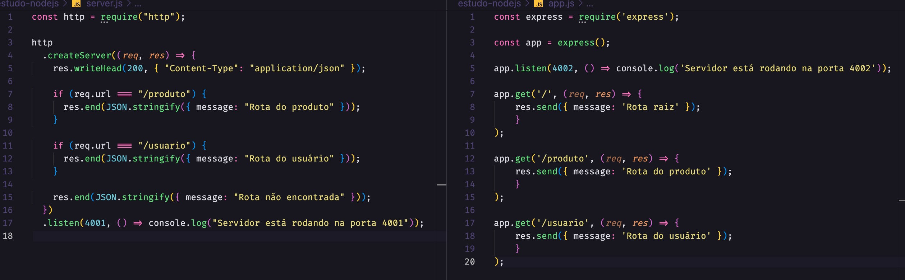
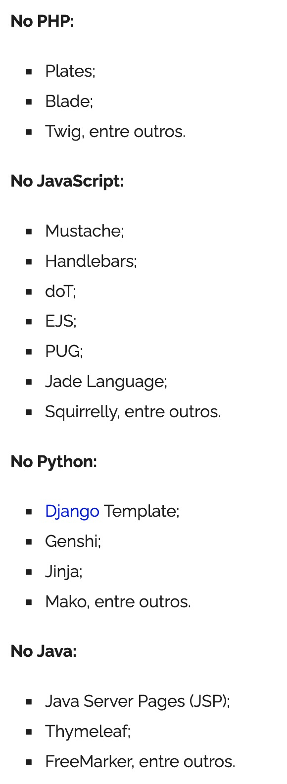

# **NodeJS**
#### [Back to README.md](README.md)
---
[Site NodeJS](https://nodejs.org/en/) \
Permite rodar aplicações JavaScript no lado do servidor \
O engine do JV é o V8 \
O JS é focado no Chrome. Não possui DOM, console ou FileSystem. \
Módulos disponíveis no Node: global, os, path, fs, http, stream entre outros \
Para entrar no REPL (Read-Eval-Print-Loop) só digitar node / Para sair do REPL só digitar .exit \

---
#### Rodando Node no VS Code: **CTRL + ALT + N**
---
Visualizar as variáveis globais: 
```javascript
console.log(global)
```

Aplições que podem ser desenvolvidas com NodeJS:
- API Rest
- Websocket
- Servless
- Streaming
- Microserviços entre outros

Frameworks para facilitar o uso:
- ExpressJS
- AdonisJS
- NestJS

NodeJS possui vários pacotes disponíveis para uso. [Módulos NodeJS](https://nodejs.org/api/modules.html)

---
### *REQUIRE* : Chamar módulos que são nativos do Node ou criados de terceiros.
```javascript
const express = require('express')
```
---

**Aplicação disponível na pasta study-nodejs**

> *Para inciar projeto NodeJS:*
> ```bash
> npm init -y
>
> ```
---
> *Nodemon para reiniciar o servidor automaticamente*
> ```bash
> npm install nodemon -D
> ```
> ```JSON
> "dev": "nodemon app.js" // package.json (script)
> ```
> 
> ```bash
> npm run dev
> ```


---
Comparativo entre padrão NodeJS para HTTP e ExpressJS:


---

### **Métodos básicso do HTTP**
- POST
- GET
- PUT
- DELETE

---
## EJS (Embedded JavaScript)
[Site do EJS](https://ejs.co/)

Linguagem de modelagem para criação de páginas HTML utilizando JavaScript.

O EJS é uma template engine (ou view engine). Serve para facilitar a criação de páginas HTML e torna o envio e exibição um processo simples e organizado. 

Para usá-lo é preciso instalar o EJS
```javascript
npm install ejs
```
*Outros template engines:*


